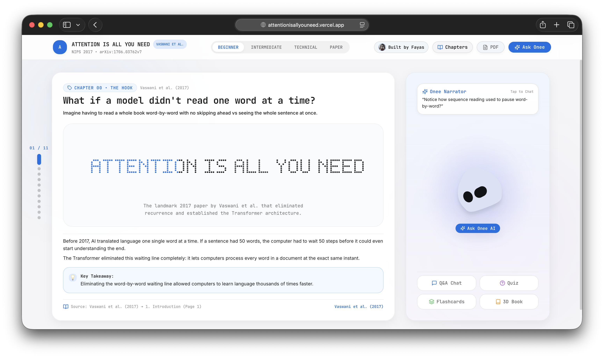
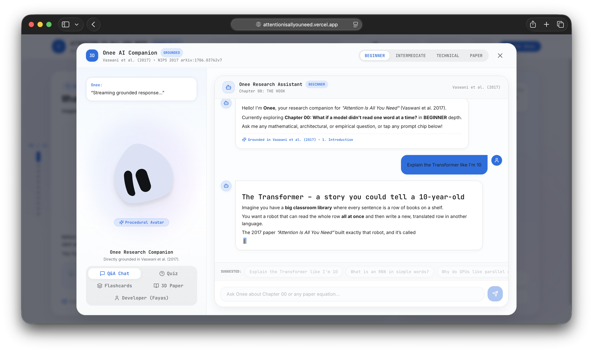

<div align="center">

# Attention Is All You Need 🧠✨

**An interactive, visual deep-dive into the Transformer architecture and the mathematical foundations of modern AI.**

[](https://reactjs.org/)
[](https://www.typescriptlang.org/)
[](https://vitejs.dev/)
[](https://tailwindcss.com/)
[](https://www.framer.com/motion/)
[](https://katex.org/)
[](https://arxiv.org/abs/1706.03762)
[](LICENSE)

<br/>


<p align="center"><em>Interactive 11-Chapter Stage with live Visualizer Sandbox, KaTeX math typesetting, and Onee Companion</em></p>

</div>

---

## 📖 Overview

**Attention Is All You Need** is an interactive, educational Single Page Application built to unpack and visualize the landmark 2017 paper by Ashish Vaswani et al. (*Google Brain, Google Research, University of Toronto*).

Instead of parsing through dense 15-page static PDFs and abstract matrix equations in isolation, this project transforms the entire Transformer paper into a hands-on, chapter-by-chapter learning experience. Every core concept — from the $\mathcal{O}(n)$ sequential bottleneck of RNNs to Scaled Dot-Product Attention, Multi-Head subspace projections, sinusoidal positional encoding frequencies, and Table 1-4 experimental benchmarks — is paired with an interactive visualizer, live mathematical formula renderer, active-recall 3D flashcards, comprehension quizzes, and a grounded AI research companion named **Onee**.

---

## ✨ Features

- **11 Interactive Paper Chapters:** Complete progressive storyline spanning the motivation, mathematical equations, architectural blocks, training benchmarks, and legacy of Vaswani et al. (2017).
- **Synchronized Multi-Tier Educational Modes:**
  - `BEGINNER`: Plain English analogies (library search, anagram sentences), intuitive concepts, zero jargon.
  - `INTERMEDIATE`: Standard machine learning terminology, embeddings, softmax, residual layers.
  - `TECHNICAL`: Deep mathematical rigor, exact tensor dimensions ($d_{\text{model}}=512, d_k=64$), FLOP complexities, gradient derivations.
  - `PAPER_MODE`: Verbatim citations, section numbers, equation numbers, and exact table rows from the 2017 paper.
- **Interactive Visualizer Sandboxes (One per Chapter):**
  - **Sequential vs Parallel Execution:** Side-by-side simulation comparing $\mathcal{O}(n)$ step delay in recurrent networks vs $\mathcal{O}(1)$ parallel matrix multiplication in Transformers.
  - **Scaled Dot-Product Attention Lab:** Dynamic query-key-value token attention matrix ($11 \times 11$) with temperature scaling and $\frac{1}{\sqrt{d_k}}$ variance stabilization toggle.
  - **Multi-Head Subspace Explorer:** Isolate each of the $h=8$ attention heads to observe syntactic agreement, coreference resolution, and causal relationship specializations.
  - **Complete Architecture Inspector:** Layer-by-layer walk-through of the $N=6$ Encoder and $N=6$ Decoder stacks, Residual Add & Norm, and Position-wise Feed-Forward Networks ($d_{\text{ff}}=2048$).
  - **Sinusoidal Positional Encoding Canvas:** Interactive high-DPI waveform generator demonstrating how geometric frequency progressions ($2\pi$ to $10000 \cdot 2\pi$) encode token positions and enable linear relative shifts.
  - **Complexity & Path Length Explorer (Table 1):** Direct comparison of per-layer complexity, sequential operations, and maximum path lengths between Self-Attention, RNNs, and Convolutions.
  - **WMT 2014 Translation Benchmarks (Table 2):** Comparative chart visualizing English-to-German (28.4 BLEU) and English-to-French (41.8 BLEU) quality against training FLOPs.
  - **Model Variations & Ablations (Table 3):** Interactive lab demonstrating how changing head count ($h=1, 8, 16$) and key size ($d_k=16, 64$) impacts BLEU score.
  - **3D Research Paper Notebook (Table 4):** Interactive 3D tilt-and-pan spreads examining English constituency parsing (WSJ 23) and architectural blueprints.
- **Onee AI Research Companion:**
  - Grounded conversational assistant answering mathematical, architectural, and empirical questions directly from the 2017 paper.
  - KaTeX LaTeX math rendering for equations.
  - Desktop-friendly horizontal wheel scrolling for suggested question chips and isolated two-way chat history navigation.
  - Procedural 3D SVG avatar with contextual reactions (thinking, working, celebrate, confused).
- **Interactive 3D Study Flashcards:** 3D flip-card deck with active recall questions on the front and detailed formula breakdowns with citations on the back.
- **Chapter Comprehension Quizzes:** Dynamic 5-question multiple-choice quizzes with randomized option shuffling, instant feedback, streak counters, and detailed explanations.
- **Fluid & Intentional Navigation:**
  - Content-first reading: scrolling or pressing down keys scrolls through chapter content naturally before advancing.
  - Two-way keyboard navigation (`ArrowDown`/`ArrowUp`, `PageDown`/`PageUp`, `Space`/`Shift+Space`, `Home`/`End`).
  - Desktop Left-Margin Chapter Rail with hover previews.
  - Independent two-way scrollable chapter selector in the navigation bar.
- **Apple-Inspired Design Language:** Restrained typography (SF Pro / Inter / SF Mono), frosted glassmorphic backdrops (`backdrop-blur-2xl`), smooth GPU-accelerated blur/fade transitions, and full mobile responsiveness.

---

## 🖼️ Screenshots

<div align="center">
<table>
  <tr>
    <td align="center" width="50%">
      
      <p align="center"><b>Interactive Stage & Visualizer</b><br/><sup>Multi-Head Attention exploration with live subspace isolating, LaTeX formulas, and synchronized narrative</sup></p>
    </td>
    <td align="center" width="50%">
      
      <p align="center"><b>3D Research Paper Notebook & Companion</b><br/><sup>Interactive 3D paper plates, dynamic prompt chips, active-recall flashcards, and Onee research assistant</sup></p>
    </td>
  </tr>
</table>
</div>

---

## 🧠 Transformer Concepts Explained

<details open>
<summary><b>1. The Sequential Bottleneck & Permutation Invariance</b></summary>

<br/>

Traditional sequence transduction models (RNNs, LSTMs, GRUs) generate a sequence of hidden states $\mathbf{h}_t = f(\mathbf{h}_{t-1}, \mathbf{x}_t)$. This inherently sequential nature prevents parallelization within training examples, forming a critical computational bottleneck at longer sequence lengths $n$.

Self-Attention replaces recurrence entirely, computing representations across all sequence positions simultaneously in $\mathcal{O}(1)$ sequential operations. However, because self-attention is permutation-equivariant:

$$\text{Attention}(P X, P X, P X) = P \cdot \text{Attention}(X, X, X)$$

Without positional signals, a sentence and any anagram permutation of its tokens would yield identical attention weights.

</details>

<details>
<summary><b>2. Scaled Dot-Product Attention & Variance Normalization</b></summary>

<br/>

Given packed query ($Q$), key ($K$), and value ($V$) matrices:

$$\text{Attention}(Q, K, V) = \text{softmax}\left(\frac{Q K^T}{\sqrt{d_k}}\right) V$$

**Why divide by $\sqrt{d_k}$?**
For large projection dimensions $d_k$ (e.g. $d_k = 64$), assuming components of $q$ and $k$ are independent random variables with mean 0 and variance 1, the dot product $q \cdot k = \sum_{i=1}^{d_k} q_i k_i$ has mean 0 and variance $d_k$. Large dot products push the softmax function into regions with vanishingly small gradients. Dividing by $\sqrt{d_k}$ scales variance back to 1.0, ensuring numerical stability.

</details>

<details>
<summary><b>3. Multi-Head Attention Subspace Projections</b></summary>

<br/>

Instead of performing a single attention function with $d_{\text{model}} = 512$, Multi-Head Attention linearly projects queries, keys, and values $h = 8$ times with different, learned linear projections to $d_k = d_v = 64$:

$$\text{MultiHead}(Q, K, V) = \text{Concat}(\text{head}_1, \dots, \text{head}_h) W^O$$

$$\text{where} \quad \text{head}_i = \text{Attention}(Q W_i^Q, K W_i^K, V W_i^V)$$

This allows the model to jointly attend to information from different representation subspaces at different positions (e.g. one head tracks syntactic dependencies, another resolves pronoun coreference).

</details>

<details>
<summary><b>4. Sinusoidal Positional Encoding & Linear Shift Property</b></summary>

<br/>

Vaswani et al. inject token order using fixed sinusoidal functions of varying frequency:

$$PE_{(pos, 2i)} = \sin\left(\frac{pos}{10000^{2i / d_{\text{model}}}}\right)$$

$$PE_{(pos, 2i+1)} = \cos\left(\frac{pos}{10000^{2i / d_{\text{model}}}}\right)$$

**Linear Relative Shift Property:** For any fixed offset $k$, $PE_{pos+k}$ can be computed as a linear transformation of $PE_{pos}$ via a $2 \times 2$ rotation matrix:

$$\begin{pmatrix} PE_{(pos+k, 2i)} \\ PE_{(pos+k, 2i+1)} \end{pmatrix} = \begin{pmatrix} \cos(\omega_i k) & \sin(\omega_i k) \\ -\sin(\omega_i k) & \cos(\omega_i k) \end{pmatrix} \begin{pmatrix} PE_{(pos, 2i)} \\ PE_{(pos, 2i+1)} \end{pmatrix}$$

This allows the self-attention mechanism to learn to attend to relative positions while effortlessly generalizing to sequence lengths unseen during training.

</details>

<details>
<summary><b>5. Layer Complexity & Path Length Analysis (Table 1)</b></summary>

<br/>

| Layer Type | Complexity per Layer | Sequential Operations | Maximum Path Length |
| :--- | :--- | :--- | :--- |
| **Self-Attention** | $\mathcal{O}(n^2 \cdot d)$ | $\mathcal{O}(1)$ | $\mathcal{O}(1)$ |
| **Recurrent (RNN)** | $\mathcal{O}(n \cdot d^2)$ | $\mathcal{O}(n)$ | $\mathcal{O}(n)$ |
| **Convolutional** | $\mathcal{O}(k \cdot n \cdot d^2)$ | $\mathcal{O}(1)$ | $\mathcal{O}(\log_k(n))$ |
| **Self-Attention (restricted)** | $\mathcal{O}(r \cdot n \cdot d)$ | $\mathcal{O}(1)$ | $\mathcal{O}(n/r)$ |

When sequence length $n < d$ (standard in machine translation where $n \approx 30, d = 512$), Self-Attention is faster per layer than RNNs while connecting any two tokens in constant $\mathcal{O}(1)$ path length.

</details>

---

## 🛠 Tech Stack

| Category | Technology | Purpose |
| :--- | :--- | :--- |
| **Frontend Framework** | **React 18** (`react`, `react-dom`) | Declarative UI, state hooks, and component hierarchy |
| **Build & Tooling** | **Vite 5.4**, **TypeScript 5.6** | Fast HMR dev server, strict type checking, and production bundling |
| **Styling & Design** | **Tailwind CSS 3.4**, **Vanilla CSS** | Apple-inspired light theme, glassmorphism, responsive grid layouts |
| **Animation & Motion** | **Framer Motion 11.11** | Blur-and-fade chapter transitions, spring physics, modal transforms |
| **Mathematical Typesetting** | **KaTeX 0.16** | High-performance LaTeX formula rendering with LRU cache |
| **Graphics & 3D** | **HTML5 Canvas API**, **CSS 3D Transforms** | Dot-matrix particle hero text, waveform canvas, 3D paper notebook |
| **Icons & UI** | **Lucide React** | Consistent, lightweight SVG interface icons |
| **AI / Inference** | **Groq Cloud API** (`openai/gpt-oss-120b`) | Streaming LLM paper assistant with embedded grounded fallback |
| **Avatar Engine** | **@bible-strong/avatar-web** | Procedural 3D SVG character controller for assistant reactions |

---

## 📁 Project Structure

```
AttentionIsAllYouNeed/
├── src/
│   ├── App.tsx                                  # Full-viewport chapter stage & transitions
│   ├── main.tsx                                 # Application entry point
│   ├── vite-env.d.ts                            # Vite environment type declarations
│   ├── index.css                                # Apple design tokens & global styles
│   │
│   ├── components/
│   │   ├── assistant/
│   │   │   ├── AvatarController.tsx             # Procedural SVG avatar controller
│   │   │   └── ChatPanel.tsx                    # Grounded research Q&A with math streaming
│   │   ├── common/
│   │   │   ├── DeveloperCard.tsx                # Creator profile & portfolio card
│   │   │   └── MarkdownRenderer.tsx             # KaTeX math & markdown parsing engine
│   │   ├── effects/
│   │   │   ├── ParticleText.tsx                 # 5x7 bitmapped dot-matrix hero canvas
│   │   │   └── Sketchbook.tsx                   # Interactive 3D paper notebook & blueprints
│   │   ├── onee/
│   │   │   ├── FullOneeOverlay.tsx              # Fullscreen multi-tab research companion
│   │   │   └── LivingOneeStage.tsx              # Ambient companion trigger & reaction stage
│   │   ├── quiz/
│   │   │   ├── Flashcards.tsx                   # 3D flip-card active recall deck
│   │   │   └── Quiz.tsx                         # 5-question comprehension quiz with confetti
│   │   ├── storytelling/
│   │   │   ├── ChapterRail.tsx                  # Desktop dot indicator rail & hover preview
│   │   │   ├── MobileScrollTransitionIndicator.tsx # Restrained mobile pull indicator
│   │   │   ├── Navigation.tsx                   # Fixed navbar & difficulty mode selector
│   │   │   └── SpatialScene.tsx                 # Main chapter presentation stage
│   │   └── visualizations/
│   │       ├── AttentionVisualizer.tsx          # Scaled Dot-Product QKV matrix lab
│   │       ├── BenchmarkChart.tsx               # Table 2 WMT 2014 BLEU vs FLOPs chart
│   │       ├── ComplexityComparison.tsx         # Table 1 per-layer complexity explorer
│   │       ├── ModelVariationLab.tsx            # Table 3 head & key ablation studies
│   │       ├── MultiHeadVisualizer.tsx          # Subspace projection inspector (h=8)
│   │       ├── PositionalEncoding.tsx           # High-DPI sinusoidal wave simulator
│   │       ├── SequentialVsParallel.tsx         # RNN O(n) vs Self-Attention O(1) comparison
│   │       └── TransformerArchitecture.tsx      # N=6 Encoder/Decoder layer stack explorer
│   │
│   ├── data/
│   │   ├── flashcardData.ts                     # Active recall question & equation deck
│   │   ├── paperData.ts                         # Complete 11 chapters, metadata & tables
│   │   └── quizData.ts                          # Comprehensive question bank & sampler
│   │
│   ├── hooks/
│   │   ├── useChapterSnap.ts                    # Content-first boundary chapter snap hook
│   │   ├── useReducedMotion.ts                  # Accessibility motion query listener
│   │   └── useScrollTransition.ts               # Mobile overscroll transition observer
│   │
│   ├── lib/
│   │   ├── groq.ts                              # Groq API streaming & grounded fallback
│   │   ├── humanizer.ts                         # Wikipedia AI-writing cleanup pipeline
│   │   └── oneeEvents.ts                        # PubSub event bridge for avatar reactions
│   │
│   └── types/
│       └── avatar.ts                            # Avatar animations and expression keys
│
├── public/                                      # Static public assets
├── Pic1.png                                     # Screenshot: Chapter Stage & Visualizer
├── Pic2.png                                     # Screenshot: 3D Paper Notebook & Companion
├── index.html                                   # HTML5 shell & fonts
├── package.json                                 # Dependencies & build scripts
├── tailwind.config.js                           # Custom colors, fonts & shadows
├── tsconfig.json                                # TypeScript compiler configuration
├── vite.config.ts                               # Vite bundler configuration
└── README.md                                    # Project documentation
```

---

## ⚙️ Installation & Local Development

### Prerequisites

- [Node.js](https://nodejs.org/) (version 18.x or later)
- `npm` or `yarn`

### 1. Clone the Repository

```bash
git clone https://github.com/MohammadFayasKhan/AttentionIsAllYouNeed.git
cd AttentionIsAllYouNeed
```

### 2. Install Dependencies

```bash
npm install
```

### 3. Configure Optional Groq API Key

The application includes an embedded, deeply grounded knowledge engine that answers paper questions out-of-the-box with zero configuration. To enable remote LLM streaming via Groq, create a `.env.local` file:

```bash
VITE_GROQ_API_KEY=your_groq_api_key_here
VITE_GROQ_MODEL=openai/gpt-oss-120b
```

### 4. Start Development Server

```bash
npm run dev
```

Open `http://localhost:5173` in your browser.

### 5. Build for Production

```bash
npm run build
```

The production-ready static assets will be generated in the `dist/` directory.

### 6. Preview Production Build

```bash
npm run preview
```

---

## 💡 Why I Built This

As a 3rd-year B.Tech CSE student pursuing an AI/ML minor, the 2017 paper *"Attention Is All You Need"* by Vaswani et al. is arguably the most influential computer science paper of the modern era — laying the foundation for GPT, BERT, Claude, LLaMA, and modern generative AI.

However, when I first read the 15-page PDF, understanding how Scaled Dot-Product Attention mathematically connects to Multi-Head projections, why dividing by $\sqrt{d_k}$ prevents gradient saturation, how sinusoidal positional encodings enable relative offset shifts without extra parameters, and how the $N=6$ Encoder-Decoder residual layers fit together took countless hours of re-reading and manual diagram sketching.

I built this project to turn that learning journey into an open, interactive tool. My goal was to create a visualizer that bridges theoretical mathematical rigor with intuitive interactive engineering — making every matrix operation, waveform, and hyperparameter ablation tangible for any student or engineer studying deep learning.

---

## 📚 What I Learned

- **Deep Transformer Mathematics:** Derived and implemented the mathematical logic for self-attention, query-key-value projections, sinusoidal geometric wave progressions, softmax temperature scaling, and residual layer normalization.
- **Coordinated Responsive UI State:** Built a decoupled event bridge (`OneeEventBridge`) that translates user interactions (sliding a frequency slider, flipping a flashcard, answering a quiz question) into synchronized procedural avatar animations.
- **Scroll & Navigation Engineering:** Solved dual-scroll container conflicts and trackpad momentum issues by designing a content-first navigation model (`useChapterSnap`) that prioritizes reading chapter content before transitioning sections.
- **Mathematical Typesetting Performance:** Integrated KaTeX with an LRU cache to render complex LaTeX formulas instantly without DOM thrashing or layout shifts.
- **High-DPI Canvas Rendering:** Engineered interactive HTML5 Canvas visualizers with device-pixel-ratio scaling, particle physics, and lifecycle observers.

---

## 🚀 Future Improvements

- [ ] **Cross-Attention Heatmap Inspector:** Interactive matrix allowing users to input two custom sentences and visualize token-to-token attention weights in real-time.
- [ ] **Client-Side ONNX Runtime:** Run a lightweight Transformer model locally in WebAssembly to demonstrate real forward-pass activations.
- [ ] **Custom Sentence Sandbox:** Enable learners to type arbitrary custom text into the Attention and Multi-Head visualizers.
- [ ] **Exportable Flashcards:** One-click export of paper flashcards to Anki (`.apkg`) format for spaced repetition.
- [ ] **Expanded Transformer Lineage:** Interactive timeline tracing how the 2017 architecture evolved into encoder-only (BERT), decoder-only (GPT), and modern sparse-attention variants.

---

## 📜 References & Credits

1. **Original Research Paper:** Vaswani, A., Shazeer, N., Parmar, N., Uszkoreit, J., Jones, L., Gomez, A. N., Kaiser, Ł., & Polosukhin, I. (2017). *Attention Is All You Need*. Advances in Neural Information Processing Systems (NIPS 2017), 30. [arXiv:1706.03762](https://arxiv.org/abs/1706.03762).
2. **Harvard NLP:** Rush, A. M. (2018). *The Annotated Transformer*.
3. **Jay Alammar:** *The Illustrated Transformer* (2018).

---

## 👨‍💻 Author

<div align="center">
  <h3><strong>Mohammad Fayas Khan</strong></h3>
  <p><em>3rd-Year B.Tech Computer Science Engineering Student (AI/ML Minor) • Lovely Professional University</em></p>
  <p><em>CGPA: 9.66 / 10 • University Honor Roll • Aspiring AI/ML Engineer</em></p>

  <p>
    <a href="https://www.linkedin.com/in/mohammadfayaskhan/" target="_blank">
      
    </a>&nbsp;
    <a href="https://github.com/MohammadFayasKhan" target="_blank">
      
    </a>&nbsp;
    <a href="mailto:fayaskhanmohammad@gmail.com">
      
    </a>&nbsp;
    <a href="https://leetcode.com/u/fayaskhanx/" target="_blank">
      
    </a>
  </p>
</div>

---

## 📝 License

This project is open-source and licensed under the [MIT License](LICENSE).
